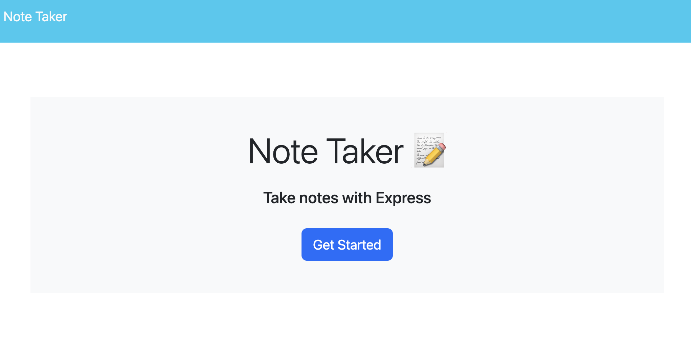

# Note Taker
  
  

## Description
This application should be used to take notes of certain things one needs to accomplish. A list of notes (or tasks) will accrue on the left side of the page, and can be clicked on again to see its full details. This is a great way to compile a list of things that need to be done in the near future .

## Table of Contents 
- [Installation](#installation)
- [Usage](#usage)
- [Credits](#credits)
- [License](#license)
- [Contributing](#contributing)

## Installation
Starting from the server.js file, you'll want to run npm i to install express and any other dependencies. After that, type "npm start" to get the server to listen on the designated PORT. Go to http://localhost:3000 in your browser and once you hit enter, you'll be able to start interacting with the application!

## Usage
When the browser is open to the homepage at http://localhost:3000, there is a button to click on in the middle of the page labeled "Get Started". Once clicked, you'll be brought to a new page where you can type in the title of your note or task, and any notes associated with the title beneath it. Once you're done, click "save" in the upper right hand corner. This new note will be added to a list of old notes on the left hand side of the page. If you wish to view an old note, simply click on it and its full details will display. 

## License
  
  This application is covered under the MIT license.

## Contributing

Using the git forking technique, you can help contribute to this repo!

## Credits

- Collaboration with tutor, Vinnie Lopez (jlopez@instructors.2u.com)
- UUID NPM package: I used [this](https://www.npmjs.com/package/uuid) package to generate a unique id for every new note that was made.

## Tests

n/a

## Questions

My GitHub username is [nvanschaack](https://github.com/nvanschaack).
You can reach me with additional questions at nellvanschaack@gmail.com.
